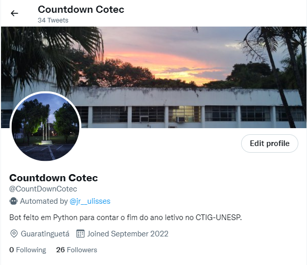

<h1 align="center">
🐍⌚ Countdown Cotec
</h1>

<h4 align="center"><a href="https://twitter.com/countdowncotec">Clique para visitar o projeto</a></h4>

---

<h2>Tecnologias utilizadas</h2>

Para o desenvolvimento deste aplicativo, utilizei as seguintes tecnologias:

- Python

- Tweepy

- Heroku

- python-dotenv

---

<h2>Objetivo do projeto</h2>

Este projeto tem o objetivo de ser um contador de dias para o fim do ano letivo no Colégio Técnico Industrial de Guaratinguetá - UNESP.